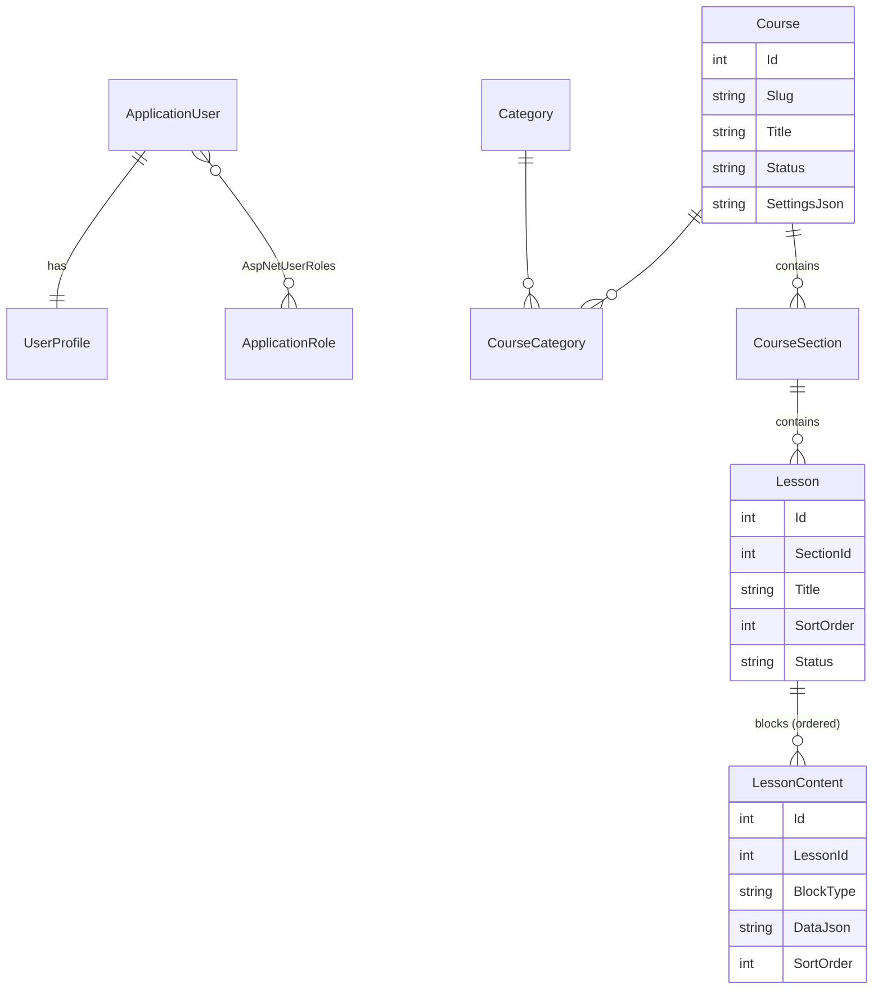
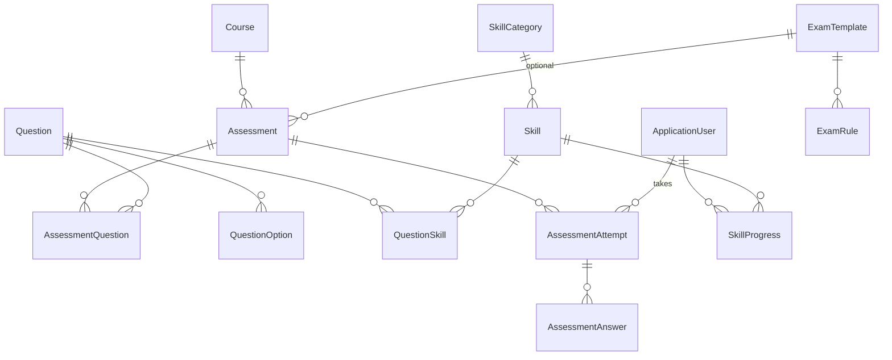
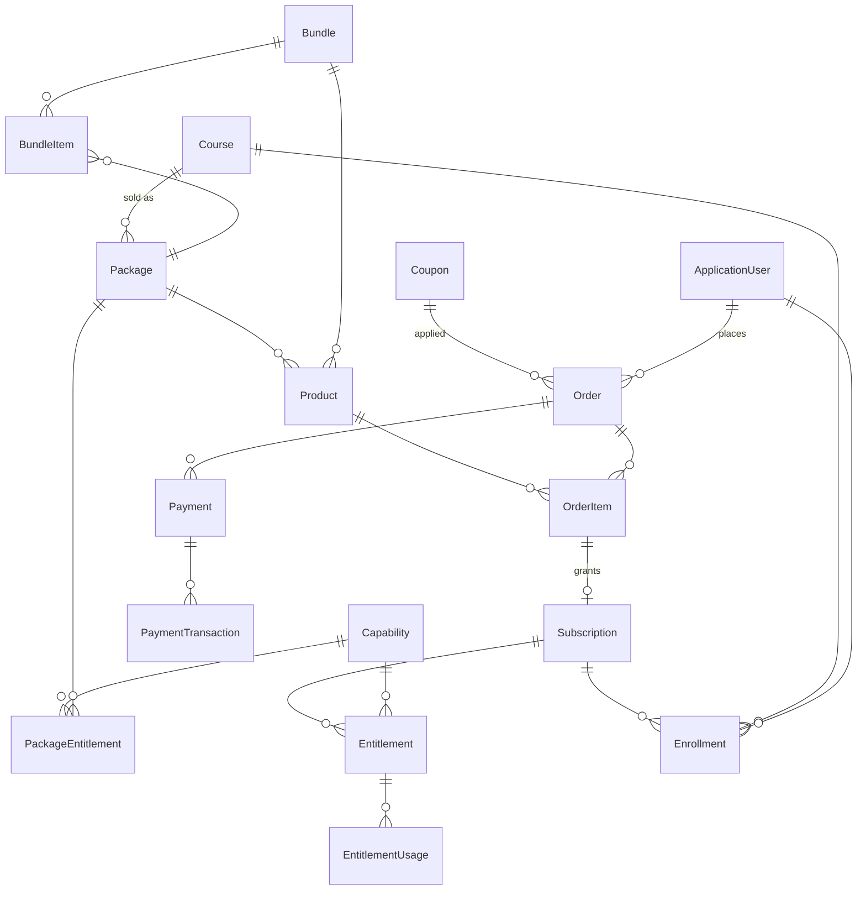
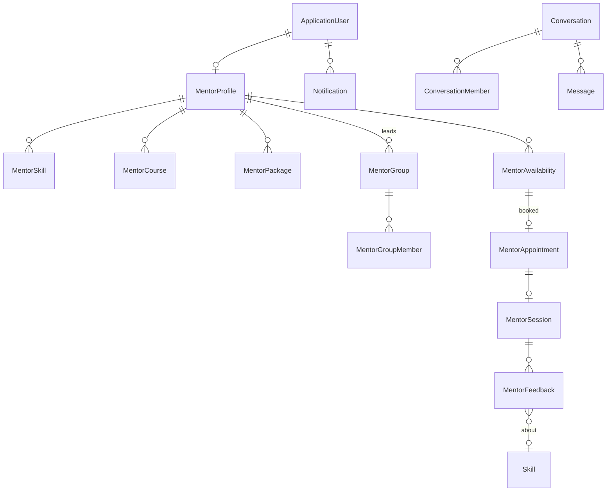

# TechKidPro – ERD (Mermaid)

Quy ước: PK `Id` (int identity, riêng Identity dùng string như ASP.NET Identity mặc định). Cột audit `CreatedDate, CreatedBy, UpdatedDate, UpdatedBy` có ở mọi bảng nghiệp vụ, không vẽ lại.
Phase 1 chỉ hiện thực hóa nhóm **Identity + Catalog lõi** (xem `Core/Entities`); phần còn lại là thiết kế cho các phase sau.

## Identity & Catalog (Phase 1–2)

## Assessment & Skill (Phase 3–4)

## Commerce & Access (Phase 5–6)

## Mentoring (Phase 7–8)

## Progress & Analytics

`CourseProgress`, `ModuleProgress`, `LessonProgress`, `AssessmentProgress` (một dòng/user/đối tượng, % + trạng thái) và `LearningActivity` (log sự kiện append-only phục vụ dashboard).
